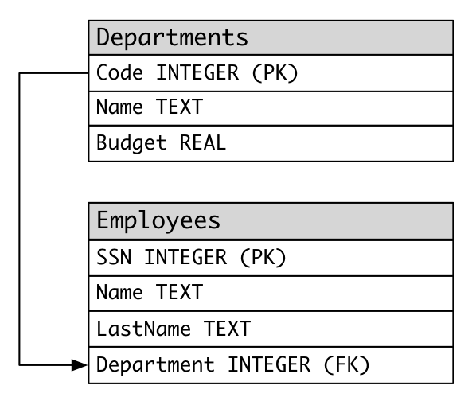

# Exercice SQL 2

Vous avez le schema suivant:

* Afin de faire les exercices, vous devez executer le script correspondant a l'exercice que vous pouvez trouvez [ici](scripts/)
* A noter, utiliser le nom des tables/colonnes donner dans le schema ci-haut ou le script (ils sont en anglais)

## Cours 7
1. Selectionner le nom de tous les employes
2. Selectionner le nom de famille sans duplicats
3. Selectionner tous les informations des employes avec un nom de famille "Smith"
4. Selectionner tous les informations des employes avec un nom de famille "Smith" ou "Doe"
5. Selectionner tous les informations des employes qui travaillent dans le departement 14
6. Selectionner tous les informations des employes qui ne travaillent dans le departement 14
7. Selectionner tous les informations des employes qui travaillent dans le departement 37 ou 77
8. Selectionner tous les informations des employes dont le nom de famille commence par "S"
9. Selectionner tous les informations des employes dont le nom de famille commence par "S" ou le prenom commence par "E"
10. Créer une vue appelée departementTI contenant les informations des employes de ce département ( Code 14)

## Cours 8
1. Selectionner la somme du budget de tous les departements
2. Selectionner le nombre d'employe par departement (montrer uniquement le code du departement)
3. Selectionner tous les informations des employes et inclure les donnees des departements de chaque employe.
4. Selectionner le nom et prenom de chaque employe en plus du nom et budget de leur departement
5. Selectionner le nom et prenom de chaque employe qui travaille pour un departement dont le budget est plus de 60000$.
6. Selectionner le nom et prenom de chaque employe qui travaille pour un departement ayant le plus petit budget.
7. Selectionner le departement avec un budget plus grand que la moyenne des budgets de tous les departements.
8. Selectionner le nom des departements avec plus de 2 employes
9. Selectionner la part en budget de chaque employé du département ressource humaines.

## Cours 9
1. Ajouter un departement "Assurance qualite" avec un budget de 40000 et un code departemental 11.
2. Ajouter un employe du nom de "Mary Moore" dans le departement 11 avec un SSN de 847-21-9811
3. Transférer l'employé  "Michael Rogers" au département "Assurance qualite"
4. Sélectionner les infomations des employés des départements TI et Recherche (Astuce : Utilisez Union)
5. Selectionner le meilleur part en budget de tout les départements
6. Reduir le budget de tous les departements de 10%
7. Augmenter le budget du département Recherche par 5% du buget total des départements.
8. Changer les employes du departement de Recherche (77) au departement TI (14)
9. Effacer les employes du departement TI (14)
10. Effacer les employes qui travaillent dans un departement avec un budget plus grand ou egal a 60000

## Cours 10 
1. Écrire un déclencheur TRG_BudgetDepartement qui empêche la création d’une nouveau département si son budget dépassent 90000$
2. Écrire une fonction f_PartBuget qui calcule et retourne la part du budget par employé, d'un département dont le code est reçu en paramètre. 
3. Écrire une fonction f_DepartementAttache qui retourne le nom du départemet d'un employé dont le SSN est fourni en paramètre.
4. Écrire une procédure p_TransfertDepartement qui permet de transférer un employé de son département A à un département B. La procédure reçoit en parametres, le SSN de l'employé et le nom du département B. Ce transfert ne s'applique pas si le département A compte moins de deux employés.

## Cours 11

1. Reformuler le déclencheur TRG_BudgetDepartement pour tolérer (via une gestion d'exception) la création d’une nouveau département si son budget dépassent 90000$. Çad, si le budget dépasse 90000$, vous devez catcher une excpetion pour accepter la création de ce département.

2. Écrire une procédure p_EmpolyesDepartementEtNbr qui affiche la liste des employés d'un département dont le code est reçu en paramètre et retourne en parametre le nombre des employés de ce département. 

3. Écrire une procédure p_EmpolyesDepartementWithCursor permettant d’afficher d'abord le nom et le budget d'un département, dont le code  est passé en paramètre. Cette procédure affichera (à l'aide d'un Curseur) ensuite la liste des employés de ce département (SSN,Name,LastName).

## Cours 12
1. Etablir la connection entre la JDBC et votre DB. De plus, pour tous les fonctions, vous devez mettre autocommit = False et completer les transactions a la main.
2. Ecrire une fonction qui insert avec une requete statique un nouveau Employees
3. Ecrire une fonction qui insert avec une requete precompilees (tous les colonnes devraient etre parametrable) un nouveau Employees
4. Ecrire une fonction qui utilise le code du cours 10 de la procedure p_TransfertDepartement. Si vous n'avez pas le code de la procedure, vous pouvez aller la chercher sur Gitlab/la coder.
5. Ecrire une fonction qui mimique la fonctionalite de la procedure p_EmpolyesDepartementWithCursor en Java. La fonction ne pourra qu'utiliser les fonctions de LMD (ie: tout refaire le code en Java)
