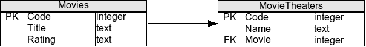

# Exercice SQL 4

Vous avez le schema suivant:

* Afin de faire les exercices, vous devez executer le script correspondant a l'exercice que vous pouvez trouvez [ici](scripts/)
* A noter, utiliser le nom des tables/colonnes donner dans le schema ci-haut ou le script (ils sont en anglais)

## Cours 7
1. Selectionner le titre de tous les films
2. Selectionner tous les ratings distinct
3. Selectionner tous les films sans ratings
4. Sélectionner les films avec un Rating 'G'
5. Selectionner les cinémas proposant un film
6. Selectionner les cinémas dont le nom contient la lettre "o"
7. Selectionner les films dont le titre ne commence pas par "The"
8. Créer une vue appelée Ratedfilms contant tous les films ayant des ratings
9. Selectionner les salle de cinémas autre celle proposant le film ayant le code 1
10. Selectionner les films dont le code varie de 4 à 6

## Cours 8
1. Selectionner le nombre des cinéma qui ne montrent pas de films actuellement
2. Calculer le nombre des films n'ayant pas des ratings
3. Selectionner le Rating le plus donné au films
4. Selectionner les cinemas présentant un film dont le titre commence par "The" 
5. Calculer la moyenne des codes des films ayant des ratings
6. Slectionner les films dont son code est supérieure ou égale au code de cinéma qui le montre.
7. Selectionner tous les donnees des theatre et y combiner les informations des films qui y joue actuellement.
8. Selectionner tous les donnes des films et si le film joue dans un theatre actuellement, y ajouter les donnees des theatres.
9. Selectionner les titres des films qui ne sont pas dans des cinemas actuellement.

## Cours 9
1. Ajouter un film "unrated" du titre "Up up!"
2. Projetez le film "Up up!"  dans les cinémas qui ne montrent pas de films actuellement 
2. Modifier le rating des films "unrated" pour la cote "G"
3. Effacer les theatres qui projetent des films de rating "PG-13"
4. Ajouter une salle de cinéma appelée "Forum", proposant le film 'Citizen Kane'
5. Selectionner les films qui se jouent uniquement dans une salle de cinéma
6. Retirer le films 'Citizen Kane' des salles des cinémas et  le remplacer par un film avec un rating "NC-17"
7. Replanifier le film 'Citizen Kane' dans le cinéma présentant le film "Up up!" et ayant le plus grans code
8. Supprimer les films qui jouent dans plus d'une salle de cinéma

## Cours 10
1. Écrire un déclencheur TRG_FilmSansRating qui modifie le rating de chaque nouveau  "unrated" film ajouté pour la cote "G" 
2. Écrire une fonction f_FilmEnCinema qui  retourne 1 si le film, dont le titre est reçu en paramètre, se montre actuellement en salles de cinéma et 0 sinon.
3. Écrire une fonction f_NombreFilmparRating qui retourne le nombre de films ayant le rating fourni en paramètre.

4. Ecrire une procedure p_AjoutFilm qui recoit les informations d'un film ainsi que le nom d'un movietheater et qui cree le film et le montre en movietheater.

## Cours 11

1. Ecrire le déclencheur TRG_NoMoreThe pour tolérer (via une gestion d'exception) l'ajout des nouveau films avec un titre commençant par 'The'. Vous devez catcher une excpetion pour accepter cet ajout.

2. Transfomer la fonction f_NombreFilmparRating en une procédure p_NombreFilmparRating qui retourne en parametre NBFilmRating le nombre de films ayant le rating fourni en paramètre.

3. Écrire une procédure p_RechercheParRating qui affiche les noms des films ayant le rating fourni en paramètre.

4. Écrire une procédure p_OuVoirCeFilm qui affiche les informations des salles des cinéma qui montre le film dont le nom est fourni en paramètre. 

## Cours 12
1. Etablir la connection entre la JDBC et votre DB. De plus, pour tous les fonctions, vous devez mettre autocommit = False et completer les transactions a la main.
2. Ecrire une fonction qui insert avec une requete statique un nouveau Movies
3. Ecrire une fonction qui insert avec une requete precompilees (tous les colonnes devraient etre parametrable) un nouveau Movies
4. Ecrire une fonction qui utilise le code du cours 10 de la procedure p_AjoutFilm . Si vous n'avez pas le code de la procedure, vous pouvez aller la chercher sur Gitlab/la coder.
5. Ecrire une fonction qui mimique la fonctionalite de la procedure p_RechercheParRating  en Java. La fonction ne pourra qu'utiliser les fonctions de LMD (ie: tout refaire le code en Java)
