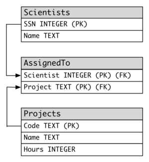

# Exercice SQL 6

Vous avez le schema suivant:

* Afin de faire les exercices, vous devez executer le script correspondant a l'exercice que vous pouvez trouvez [ici](scripts/)
* A noter, utiliser le nom des tables/colonnes donner dans le schema ci-haut ou le script (ils sont en anglais)
* VEUILLEZ VALIDER LE NOM DES COLONNES DANS LE CODE DU SCRIPT (ET NON UNIQUEMENT SUR LE ERD) POUR CE NUMERO. Les noms ont changes un peu dans certains cas ou les noms sont des caracteres reservez en SQL.

# Cours 7
1. Sélectionner la liste des projets ( code et nom)
2. Sélectionner la liste des projets dont le code commence par 'B'
3. Sélectionner la liste des projets dont la durée varie entre 400 et 1000 heures
4. Sélectionner la liste des projets en liasion avec l'aerodynamique (le nom du projet contient Aerodynamics )
5. Sélectionner les schientifiques dont le nom de famille est 'Smith'
6. Sélectionner les schientifiques dont le prénom ne commence pas par A et le nom de famille ne se termine pas par Y
7. Créer une vue appelée SmallProjetcs contenant les projets ayant une durée inférieur ou égale à 321 heures
8. Créer une vue appelée AerodynamicsProjetcs contenant les projets dont le code contient 'Ae'

# Cours 8
1. Lister tous les noms des scientifiques, le nom et le nombres d'heures des projets sur lesquels ils travaillent et trier en ordre croissant d'heures travaillees.
2. Lister les moyennes des durées des projets par famille de projet ( Ae.. As.. Bt..)
3. Lister le nombre des projets par famille
4. Lister les projet sans scientifique assigné
5. Déterminer le plus long projet 
6. Déterminer le plus court projet affecté à un scientifique ainsi que les coordonnées de ce scientifique oeuvrant sur ce projet
7. Lister la durée totale des projets en aérodynamique (le nom du projet contient Aerodynamics )
8. Meme question que 7 mais restreindre la durée totale uniquement pour des projets ayant des scientifiques assignés

# Cours 9
1. Lister les projet ayant une durée qui dépassent la moyenne des durées de tout les projets
2. Ajouter la scientifique "Marie Curie" ayant un SSN 875653246
3. "Marie Curie"  travaillera sur le projet 'Aerodynamics of Air Hockey'
4. Transféer les scientifuqes oeuvrant sur le projet 'Build Your Own Telescope' vers le projet 'A Magnetic Primer Designer'
5. Transférer 'Carol Smith' vers le projet 'Aerodynamics of Air Hockey'
6. Réduire la durée des projets par 200 heures si le projet a une durée qui dépasse 800 heures
7. Ajouter 200 heures pour projets n'ayant pas des scientifiques assignés
8. Le scientifique 'Joe Stevens' prendra sa retraite. Vous devez le supprimer de la bd et affecter "Marie Curie" pour son projet

# Cours 10 
1. Ecrire une fonction f_DureeFamilleProjets qui retoune la durée totale d'un projet ou de famille de projet. La fonction prend en parametre un code projet (AeH1 , AsT1, ..) ou bien une famille de projet ( Ae, As, Bt, ..)

2. Écrire une procédure p_TransfertScientifique  qui permet de transférer un scientifique oeuvrant sur un projet A vers un projet B. La procédure reçoit en parametres, le SSN du scientifique, le code du projet A et le code du projet B.

3. Écrire un déclencheur TRG_TransfertScientifique  qui empêche le transfert d’un scientifique d'un projet à un autre projet d'une différente famille. (exepmles : transfert de AeH1 vers AeH6 tolérée, transfert de AeH1 vers AeH6 vers As3 refusé ). Afficher un message en console si un transfert est empêché.

# Cours 11

1. Écrire un déclencheur TRG_TransfertScientifique pour tolérer  (via une gestion d'exception)  le transfert d’un scientifique d'un projet à un autre projet d'une différente famille. Çad, vous devez catcher une exception pour accepter l'update en question

2. Ecrire un procédure p_ModifierDureeProjet qui permet de augmenter ou diminuer la durée d'un projet. La procédure reçoit en parametres le code du projet , la durée à ajouter ou diminuer et un parametre Op indiquant le type d'opération à effectuer (0 pour diminution et 1 augmentation). La procédure retourne également en parametre la nouvelle durée de projet.  

3. Écrire une procédure p_InfosfamilleProjet permettant d’afficher d'abord la liste des infomations des projets (Nom, durée) correspondants à la famille rentrée ne parametre (Ae, Bt, ...). Cette procédure affichera (à l'aide d'un Curseur) ensuite pour chaque projet de la famille en question, la liste des scientifiques (nom) assignés à ce projet.

## Cours 12
1. Etablir la connection entre la JDBC et votre DB. De plus, pour tous les fonctions, vous devez mettre autocommit = False et completer les transactions a la main.
2. Ecrire une fonction qui insert avec une requete statique un nouveau projet
3. Ecrire une fonction qui insert avec une requete precompilees (tous les colonnes devraient etre parametrable) un nouveau Projet
4. Ecrire une fonction qui utilise le code du cours 10 de la procedure p_TransfertScientifique. Si vous n'avez pas le code de la procedure, vous pouvez aller la chercher sur Gitlab.
5. Ecrire une fonction qui mimique la fonctionalite de la procedure p_ModifierDureeProjet en Java. La fonction ne pourra qu'utiliser les fonctions de LMD (ie: tout refaire le code en Java)
