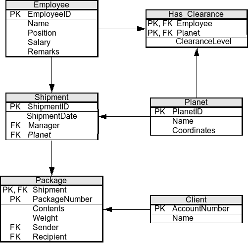

# Exercice SQL 7

Vous avez le schema suivant:

* Afin de faire les exercices, vous devez executer le script correspondant a l'exercice que vous pouvez trouvez [ici](scripts/)
* A noter, utiliser le nom des tables/colonnes donner dans le schema ci-haut ou le script (ils sont en anglais)
* VEUILLEZ VALIDER LE NOM DES COLONNES DANS LE CODE DU SCRIPT (ET NON UNIQUEMENT SUR LE ERD) POUR CE NUMERO. Les noms ont changes un peu dans certains cas ou les noms sont des caracteres reservez en SQL.

# Cours 7

1. Sélectionner la liste des clients
2. Sélectionner la liste des employés ayant une salaire qui dépasse 5001$
3. Sélectionner la liste des employés ayant une salaire qui varient de 1000$ à 10000$
4. Sélectionner le CEO
5. Sélectionner les clients ayant le prénom John
6. Sélectionner les clients ayant le prénom qui ne commence pas par 'J'
7. Sélectionner les employés ayant une remarque
8. Créer une vue appelé NotOPlanet contenant les noms des planètes qui ne contient pas la lettre 'o'

# Cours 8

1. Déterminer la moyennes des salaires des employés
2. Déterminer le poids total des packages 'Undeclared'
3. Déterminer qui a recu le package de 1.5kg
4. Déterminer qui a envoyé le package de 1.5kg
5. Déterminer le poids total des packages envoyés par 'Al Gores Head'
6. Grouper les clients par nombres de packages envoyés
6. Parmi les clients qui ont recu des packages déterminer celui qui le poids total minimal.
7. Déterminer les clients qui n'ont pas reçu des packages
8. Déterminer les clients qui ont envoyé et reçu des packages

# Cours 9

1. Afficher les nom des employes et des clients
2. Afficher les nom des employes et des clients ayant un nom de famille qui contient 'Zoi'
3. Augmenter les salaires des employés par 20% si leurs salaires est inférieure à 10000$
4. Engager un livreur ('Delivery boy') appelé "Usain Bolt" avec une salaire de 9000 et une remarque 'Usain est rapide !'
5. Déterminer la liste des employés ayant une salaire qui dàpasse la moyenne des salaire
6. Inscriver la date '3006/05/11' pour les 'shipments' n'ayant pas une date
7. Déterminer le poids total des packages envoyés par le client qui a reçu le package de 1.5kg
8. Le 'Janitor' a démissionné, retirez le de la base de données

# cours 10

1. Ecrire une procédure p_suivrePackage qui affiche les informations d'un package dont le packageNumber est founi en parametre. Vous devez afficher les infos du package (Contenu, poids), le nom de l'expéditeur et le nom de destinataire et la date de réception ( si elle existe ie. NOT NULL)

2. Ecrire une procédure p_MAJSalaire qui met a jour le salaire d'un employé dont l'id est founi en parametre. La procédure reçoit egalement, la poucentage de mise à jour de salaire à appliquer et un parametre Op indiquant le type d'opération à effectuer (0 pour diminution et 1 augmentation).

3. Écrire un déclencheur TRG_AjoutSalarier qui empêche l'ajout d'un employé à la db si son salaire est inférieur strictement à 5000.0

4. Ecrire une fonction f_ActivitéClient qui prend en parametre l'id d'un client et que retourne (0, 1, 2, ou 3) avec 0 si le client n'a effectué aucun envoi\reception d'un package, 1 si ce dernier à envoyé uniquement des packages, 2 1 si ce dernier à reçu uniquement des packages et enfin 3 si le client a effectuer des opérations d'envoi et réception.

# Cours 11
1. Modifier le déclencheur TRG_AjoutSalarier pour tolérer (via une gestion d'exception) l'ajout d'un employé à la db si son salaire est inférieur strictement à 5000.0 à condition qu'il soit considéré comme satgiaire (Intern). Çad,  vous devez catcher une excpetion pour accepter cet ajout. Si le salaire de ce stagiaire est inférieure à 3000.0 empêchez l'ajout.

2. Refomuler la procédure p_suivrePackage en garadant le meme logique et retournant en parametre NomLivreur le nom de l'employé qui livre le package.

3. Transfromer f_ActivitéClient en une procédure p_ActivitéClient qui prend en parametre le nom complet du client ( et non pas que l'id ), si le nom n'existe pas dans la db, enclencher une excpetion (Raise application error) indiauant que le client ne figure pas dans la db" Si le nom client figure deux fois ou plus dans la db considerer la premiere instance pour impléemnter le même logique de f_ActivitéClient. La procédure retoune f_ActivitéClient  en parametre ActivClient.  

## Cours 12
1. Etablir la connection entre la JDBC et votre DB. De plus, pour tous les fonctions, vous devez mettre autocommit = False et completer les transactions a la main.
2. Ecrire une fonction qui insert avec une requete statique un nouveau Package
3. Ecrire une fonction qui insert avec une requete precompilees (tous les colonnes devraient etre parametrable) un nouveau Package
4. Ecrire une fonction qui utilise le code du cours 10 de la procedure p_suivrePackage. Si vous n'avez pas le code de la procedure, vous pouvez aller la chercher sur Gitlab.
5. Ecrire une fonction qui mimique la fonctionalite de la procedure p_MAJSalaire en Java. La fonction ne pourra qu'utiliser les fonctions de LMD (ie: tout refaire le code en Java)
