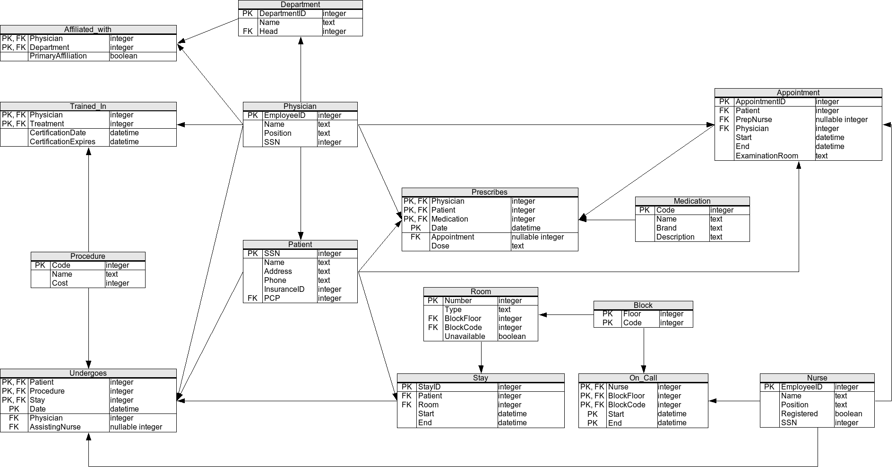

# Exercice SQL 8

Vous avez le schema suivant:

* Afin de faire les exercices, vous devez executer le script correspondant a l'exercice que vous pouvez trouvez [ici](scripts/)
* A noter, utiliser le nom des tables/colonnes donner dans le schema ci-haut ou le script (ils sont en anglais)
* VEUILLEZ VALIDER LE NOM DES COLONNES DANS LE CODE DU SCRIPT (ET NON UNIQUEMENT SUR LE ERD) POUR CE NUMERO. Les noms ont changes un peu dans certains cas ou les noms sont des caracteres reservez en SQL.

# Cours 7
1. Sélectionner la liste des médecins
2. Sélectionner la liste des médecins ayant le prénom John
3. Sélectionner les procédure ayant un prix inférieure à 2000$
4. Sélectionner l'infirmière qualifiée comme 'Head Nurse' 

# Cours 8

1. Trouver le nom des medecins qui ont performer des procedures medicales pour lesquelles ils n'etaient pas certifier.
2. Obtenir l'information pour les rendez-vous ou un patient a rencontre un medecin different de sont "primary care physician". Lister le nom du patient, le nom du medecin, le nom de l'infirmier (si existe), le debut et la fin du rendez vous, la piece dans lequel le rendez-vous a eu lieu et le nom du "primary care physician" du patient.
3. Obtenir le nom de tous les infirmiers qui on deja ete en appel a la piece 123.
4. Obtenir le nombre de rendez-vous qui a eu lieu dans chaque piece.

# Cours 9
1. Trouver le nom des medecins qui ont performer des procedures medicales pour lesquelles ils n'etaient pas certifier. De plus, ajouter le nom de la procedure, la date (table Undergoes), et le nom du patient.
2. Trouver le nom des medecins qui ont performer des procedures medicales pour lesquelles ils etaient certifies MAIS que la date de la procedure (dans table Undergoes) etaient apres la date d'expiration de la certification.

# cours 10

1. Ecrire une fonction f_UndergoProcOver qui permet de retouner 0 ou 1 telque 0 indique que le client, dont le Nom et InsuranceID sont founis en parametres, n'a subi aucune procédure dépassant le montant fourni en parametre de la fonction également. Par ailleur 1 indiquera le cas contraire.
2. Ecrire une procédure p_RechercheMultiFiltre qui recoit 2 parametres : le premier est un mot clé référant une recherche par nom (par exemple John, Clock, etc. ), et un deuxieme un mot clé référent l'attribut position (exemple Psychiatrist,  Internist etc). La procédure affiche la liste des medecins ( nom complet) répondant au critere de recherche. La procdure offrira la possibilté de se limiter à un seul filtre de recherche (par nom uniquement par exemple) en précisant NULL pour le deuxieme parametres ( exemple p_RechercheMultiFiltre('NomMedecin', NULL).)  
Remarque : p_RechercheMultiFiltre('NomMedecin', NULL) affiche la liste complète des médecins.

# cours 11

1. Transformer la fonction f_UndergoProcOver en une procédure f_UndergoProcOver en retournant le résultat de la fonction dans le prarametr VarUndergoProcOver et en affichant si VarUndergoProcOver retourne 1 la liste des ces procédures dépassant le montant fourni. 
2. Ecrire une procédure qui affiche la liste des prescriptions d'un patient qui s'est vu prescrire des médicaments par son médecin PCP (Primary Care physician)" La procédure reçoit en parametre le nom du patient. 
Remarque : si lenom du patient ne figure pas dans la DB, enclencher en exception (Raise application error) et afficher un message d'erreur 

## Cours 12
1. Etablir la connection entre la JDBC et votre DB. De plus, pour tous les fonctions, vous devez mettre autocommit = False et completer les transactions a la main.
2. Ecrire une fonction qui insert avec une requete statique un nouveau patient
3. Ecrire une fonction qui insert avec une requete precompilees (tous les colonnes devraient etre parametrable) un nouveau patient
4. Ecrire une fonction qui utilise le code du cours 11 de la procedure p_PrescriptionsPCP. Si vous n'avez pas le code de la procedure, vous pouvez aller la chercher sur Gitlab.
5. Ecrire une fonction qui mimique la fonctionalite de la procedure p_RechercheMultiFiltre en Java. La fonction ne pourra qu'utiliser les fonctions de LMD (ie: tout refaire le code en Java)

